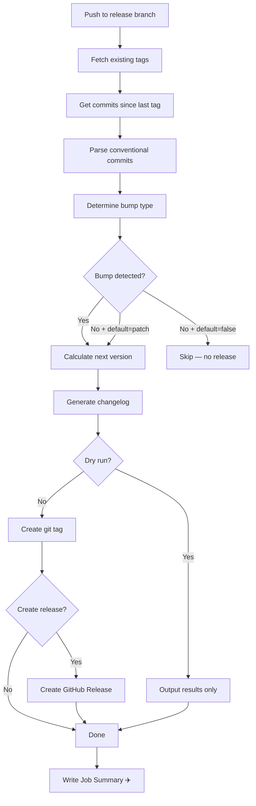

<p align="center">
  <h1 align="center">✈️ Release Pilot</h1>
  <p align="center">
    <strong>The definitive GitHub Action for semantic versioning, tagging, changelog generation, and releases.</strong>
  </p>
  <p align="center">
    Powered by <a href="https://www.conventionalcommits.org/">Conventional Commits</a> · Zero config · One action does it all
  </p>
</p>

---

## Why Release Pilot?

Most release workflows require chaining 3+ actions together, configuring complex tools, or relying on deprecated projects. **Release Pilot** replaces all of that with a single, modern action:

| Feature | Release Pilot | Others |
|---------|:---:|:---:|
| Conventional Commits parsing | ✅ Native | 🔗 External dep |
| Version calculation | ✅ Built-in | ✅ |
| Changelog generation | ✅ Built-in | 🔗 Needs another action |
| GitHub Release creation | ✅ Built-in | 🔗 Needs another action |
| Job Summary | ✅ Beautiful | ❌ |
| Breaking change detection (`!` + footer) | ✅ Both | ⚠️ Varies |
| Pre-release support | ✅ | ⚠️ Varies |
| Floating major/minor tags (`v2`, `v2.3`) | ✅ Built-in | ❌ Manual scripts |
| Node.js 24 + ESM | ✅ Modern | ❌ Legacy |
| Zero dependencies* | ✅ | ❌ |

<sub>* Only uses official `@actions/*` packages and `semver`.</sub>

## Quick Start

```yaml
name: Release
on:
  push:
    branches: [main]

permissions:
  contents: write

jobs:
  release:
    runs-on: ubuntu-latest
    steps:
      - uses: actions/checkout@v4
        with:
          fetch-depth: 0

      - name: ✈️ Release Pilot
        uses: your-username/release-pilot@v1
        with:
          token: ${{ secrets.GITHUB_TOKEN }}
```

That's it. **Zero config.** Release Pilot will:

1. Parse all commits since the last tag using Conventional Commits
2. Determine the next SemVer version
3. Create an annotated git tag
4. Output the version, tag, and changelog

## Examples

### Tag + GitHub Release

```yaml
- name: ✈️ Release Pilot
  uses: your-username/release-pilot@v1
  with:
    token: ${{ secrets.GITHUB_TOKEN }}
    create-release: true
    release-title: 'Release {{tag}}'
```

### Tag + Use Version Downstream

```yaml
- name: ✈️ Release Pilot
  id: release
  uses: your-username/release-pilot@v1
  with:
    token: ${{ secrets.GITHUB_TOKEN }}

- name: 🐳 Build Docker Image
  if: steps.release.outputs.released == 'true'
  run: |
    docker build -t myapp:${{ steps.release.outputs.version }} .
    docker push myapp:${{ steps.release.outputs.version }}
```

### Pre-release from Feature Branches

```yaml
- name: ✈️ Release Pilot
  uses: your-username/release-pilot@v1
  with:
    token: ${{ secrets.GITHUB_TOKEN }}
    prerelease: true
    prerelease-suffix: beta
    branches: '.*'  # Allow all branches
```

### Dry Run (CI Validation)

```yaml
- name: ✈️ Preview Release
  uses: your-username/release-pilot@v1
  with:
    token: ${{ secrets.GITHUB_TOKEN }}
    dry-run: true
```

### Custom Release Rules

```yaml
- name: ✈️ Release Pilot
  uses: your-username/release-pilot@v1
  with:
    token: ${{ secrets.GITHUB_TOKEN }}
    custom-rules: 'hotfix:patch:🔥 Hotfixes,improvement:minor:💡 Improvements'
```

### Floating Major/Minor Tags (GitHub Action Style)

Automatically maintain `v2` → latest `v2.x.x` and `v2.3` → latest `v2.3.x` tags,
just like `actions/checkout@v4` does:

```yaml
- name: ✈️ Release Pilot
  uses: your-username/release-pilot@v1
  with:
    token: ${{ secrets.GITHUB_TOKEN }}
    major-tag: true    # v2 always points to latest v2.x.x
    minor-tag: true    # v2.3 always points to latest v2.3.x
```

> When you release `v2.3.1`, Release Pilot creates three tags:
> - `v2.3.1` — the exact version (immutable)
> - `v2.3` — floats to latest `v2.3.x` (force-updated)
> - `v2` — floats to latest `v2.x.x` (force-updated)

## 📥 Inputs

| Input | Description | Default |
|-------|-------------|---------|
| `token` | GitHub token for authentication | `${{ github.token }}` |
| `prefix` | Tag prefix | `v` |
| `default-bump` | Bump when no conventional type found (`patch`, `minor`, `major`, `false`) | `patch` |
| `initial-version` | Starting version when no tags exist | `0.1.0` |
| `prerelease` | Enable prerelease mode | `false` |
| `prerelease-suffix` | Prerelease identifier (e.g., `beta`) | Branch name |
| `branches` | Comma-separated release branch patterns (regex) | `main,master` |
| `create-release` | Create a GitHub Release | `false` |
| `release-draft` | Create release as draft | `false` |
| `release-title` | Release title template (`{{version}}`, `{{tag}}`) | `{{tag}}` |
| `annotated` | Create annotated tags | `true` |
| `commit-sha` | Override the commit SHA | `GITHUB_SHA` |
| `dry-run` | Calculate without creating anything | `false` |
| `custom-rules` | Custom commit type rules | `''` |
| `include-body-in-changelog` | Include commit body in changelog | `false` |
| `major-tag` | Create/update floating major tag (`v2` → latest `v2.x.x`) | `false` |
| `minor-tag` | Create/update floating minor tag (`v2.3` → latest `v2.3.x`) | `false` |

## 📤 Outputs

| Output | Description | Example |
|--------|-------------|---------|
| `version` | New version without prefix | `1.2.3` |
| `tag` | New tag with prefix | `v1.2.3` |
| `previous-version` | Previous version | `1.2.2` |
| `previous-tag` | Previous tag | `v1.2.2` |
| `bump` | Bump type applied | `minor` |
| `changelog` | Generated changelog (markdown) | See below |
| `release-url` | URL to GitHub Release | `https://...` |
| `released` | Whether a release was made | `true` |

## Conventional Commits

Release Pilot follows the [Conventional Commits](https://www.conventionalcommits.org/) specification:

```
<type>[optional scope][!]: <description>

[optional body]

[optional footer(s)]
```

### Default Commit Types → Bumps

| Type | Bump | Changelog Section |
|------|------|-------------------|
| `feat` | **minor** | 🚀 Features |
| `fix` | **patch** | 🐛 Bug Fixes |
| `perf` | **patch** | ⚡ Performance |
| `revert` | **patch** | ⏪ Reverts |
| `docs` | none | 📚 Documentation |
| `style` | none | 💄 Styling |
| `refactor` | none | ♻️ Refactoring |
| `test` | none | ✅ Tests |
| `build` | none | 📦 Build |
| `ci` | none | 🔧 CI/CD |
| `chore` | none | 🧹 Chores |

### Breaking Changes → `major`

Breaking changes are detected via:

```
feat!: remove deprecated API
```

or:

```
feat: refactor authentication

BREAKING CHANGE: The auth token format has changed.
```

## How It Works



## Requirements

- **Checkout with full history:** Always use `fetch-depth: 0` in your checkout step.
- **Write permissions:** The token needs `contents: write` permission.
- **Node.js 24:** This action runs on Node.js 24 (handled automatically by GitHub Actions).

## License

MIT © Jonas Ranerfors
